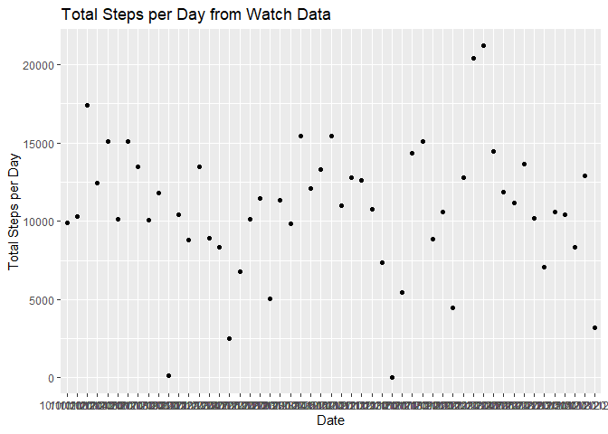
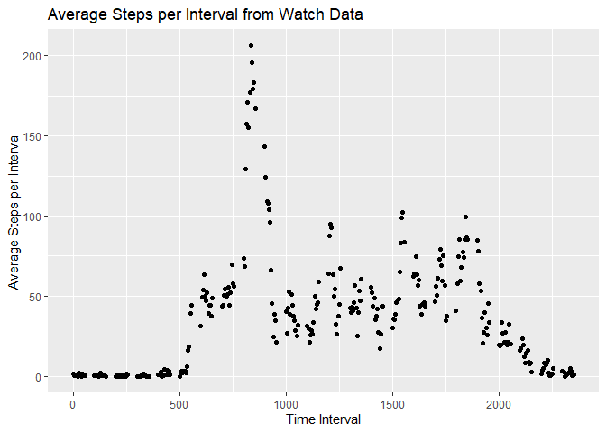
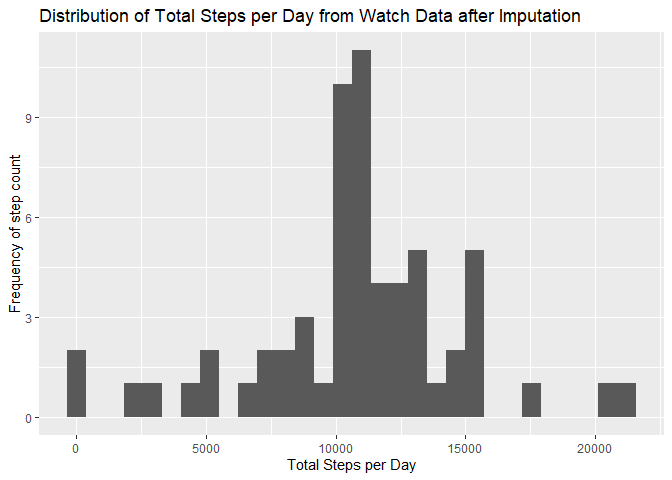
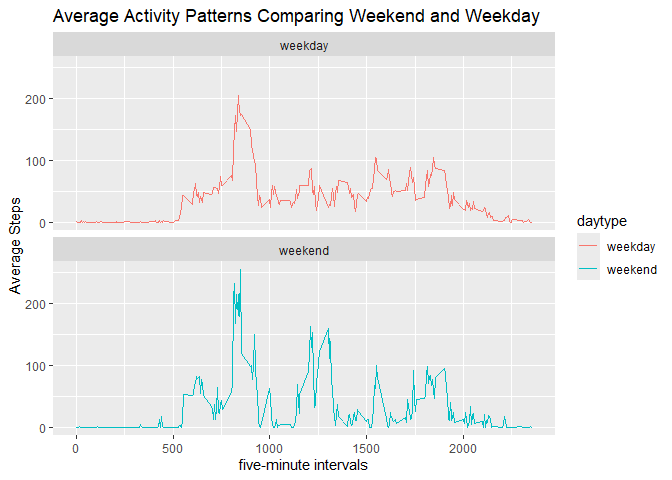

Loading Libraries and changing default


``` r
 # This accounts for a limitation in RStudio
  options("max.print" = 9999999)
  
  #load libraries needed
  library(ggplot2)
  library(grid)
  library(dplyr)
```

```
## 
## Attaching package: 'dplyr'
```

```
## The following objects are masked from 'package:stats':
## 
##     filter, lag
```

```
## The following objects are masked from 'package:base':
## 
##     intersect, setdiff, setequal, union
```

## Loading and preprocessing the data

The data were downloaded from [The Course Website](https://d396qusza40orc.cloudfront.net/repdata%2Fdata%2Factivity.zip)

These data were then loaded into the current working directory (as a csv file), activity.csv
A dataframe, activity, was generated via read.csv


``` r
activity <- read.csv("~\\R\\datasciencecoursera\\RepData_PeerAssessment1\\activity.csv")
str(activity)
```

```
## 'data.frame':	17568 obs. of  3 variables:
##  $ steps   : int  NA NA NA NA NA NA NA NA NA NA ...
##  $ date    : chr  "10/1/2012" "10/1/2012" "10/1/2012" "10/1/2012" ...
##  $ interval: int  0 5 10 15 20 25 30 35 40 45 ...
```

``` r
summary(activity)
```

```
##      steps            date              interval     
##  Min.   :  0.00   Length:17568       Min.   :   0.0  
##  1st Qu.:  0.00   Class :character   1st Qu.: 588.8  
##  Median :  0.00   Mode  :character   Median :1177.5  
##  Mean   : 37.38                      Mean   :1177.5  
##  3rd Qu.: 12.00                      3rd Qu.:1766.2  
##  Max.   :806.00                      Max.   :2355.0  
##  NA's   :2304
```


## What is mean total number of steps taken per day?


``` r
  #load data into function
  activity <- read.csv("~\\R\\datasciencecoursera\\RepData_PeerAssessment1\\activity.csv")
  #remove NA
  stepdata <- activity[!is.na(activity$steps),]
  #sum step data by day
     newstepday <- aggregate(steps ~ date, data = stepdata, sum)
     newstepmean <- sprintf("%.4f",mean(newstepday$steps))
     newstepmedian <- median(newstepday$steps)
     
     #plot
     ggplot(data = newstepday, aes(x = steps)) + geom_histogram() +
       labs(title = "Distribution of Total Steps per Day from Watch Data") +
       xlab("Total Steps per Day") +
       ylab("Frequency of step count")
```

```
## `stat_bin()` using `bins = 30`. Pick better value `binwidth`.
```

<!-- -->

``` r
       dev.copy(png,file="plot1.png")
```

```
## png 
##   3
```

Participants walk an average of 10766.1887 daily.

The median number of steps participants take daily is 10765.


## What is the average daily activity pattern?


``` r
  #sum step data by day
  meanstepinterval <- aggregate(steps ~ interval, data = stepdata, mean)
 
  maxsteps <- meanstepinterval$interval[meanstepinterval$steps == max(meanstepinterval$steps)]
  
#  plot(meanstepinterval$interval,meanstepinterval$steps, type = "l", main = "Average Steps per Interval Through Day", 
##     xlab = "Interval", ylab = "Average Step Count")
#  abline(v = maxsteps, col = "red", lty = 4)
  ggplot(data = meanstepinterval) + geom_line(mapping= aes(x = interval, y = steps)) +
    labs(title = "Average Steps per Interval from Watch Data") +
    xlab("Time Interval") +
    ylab("Average Steps per Interval") +
    geom_vline(mapping = aes(xintercept = maxsteps), col = "red")
```

<!-- -->

``` r
  dev.copy(png,file="plot2.png")
```

```
## png 
##   4
```
  
 
  The time interval where the participant mean step count is the highest is 835, denoted by the $\color{red}{\text{red}}$ line.


## Imputing missing values

``` r
#calculate number of missing values
  missing_steps <- sum(is.na(activity$steps))

# calculate mean steps for each interval
  meanstepsperinterval <- activity %>%
    group_by(interval) %>%
   summarize(meansteps = mean(steps, na.rm = TRUE))
 

  #impute missing data
  imputesteps <- activity %>%
    left_join(meanstepsperinterval, by = "interval") %>%
    mutate(steps = ifelse(is.na(steps),meansteps, steps)) %>%
    select(-meansteps)
  
  #calculate totals after imputing data  
  totalstepsall <- imputesteps %>%
      group_by(date) %>%
      summarize(totalsteps = sum(steps))
                 
  
  # histogram of imputed data
       ggplot(data = totalstepsall, aes(x = totalsteps)) + geom_histogram() +
         labs(title = "Distribution of Total Steps per Day from Watch Data after Imputation") +
         xlab("Total Steps per Day") +
         ylab("Frequency of step count")
```

```
## `stat_bin()` using `bins = 30`. Pick better value `binwidth`.
```

<!-- -->

``` r
  dev.copy(png,file="plot3.png")
```

```
## png 
##   5
```

There were 2304 missing values in this data set.

## Are there differences in activity patterns between weekdays and weekends?


``` r
 # create a new variable for type of day
  imputesteps$daytype <- ifelse(weekdays(as.Date(imputesteps$date)) %in% c("Saturday", "Sunday"), "weekend", "weekday")
 # calculate steps for intervals grouped by daytype and interval
  avedaysteps <- imputesteps %>%
      group_by(interval, daytype) %>%
        summarize(meansteps = mean(steps))
```

```
## `summarise()` has grouped output by 'interval'. You can override using the
## `.groups` argument.
```

``` r
  # create the plot
  ggplot(avedaysteps, aes(x = interval, y = meansteps, color = daytype)) +
      geom_line() +
      facet_wrap(~daytype, ncol = 1) +
      labs(title = "Average Activity Patterns Comparing Weekend and Weekday", x = "five-minute intervals",
           y = "Average Steps") 
```

<!-- -->

``` r
  dev.copy(png,file="plot4.png")
```

```
## png 
##   6
```

It appears as though the participants are more active across more of the day during weekends than on weekdays.


 
