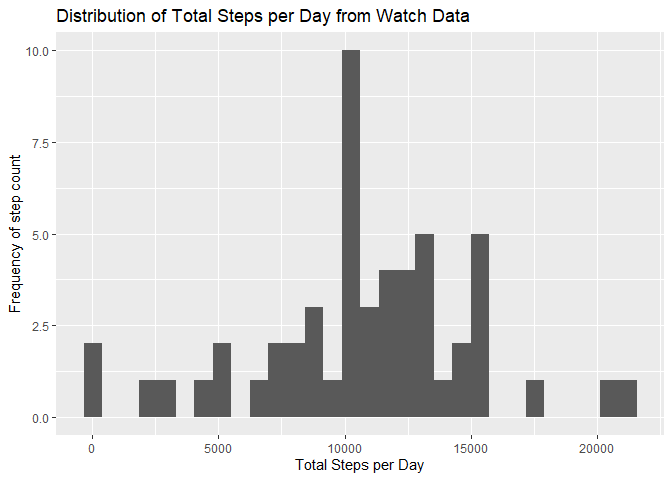
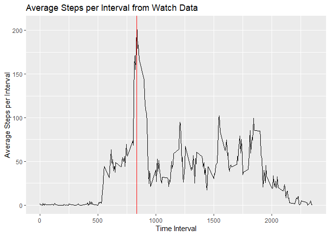

Loading Libraries and changing default

``` r
 # This accounts for a limitation in RStudio
  options("max.print" = 9999999)
  
  #load libraries needed
  library(ggplot2)
  library(grid)
  library(dplyr)
```

```
## 
## Attaching package: 'dplyr'
```

```
## The following objects are masked from 'package:stats':
## 
##     filter, lag
```

```
## The following objects are masked from 'package:base':
## 
##     intersect, setdiff, setequal, union
```

## Loading and preprocessing the data

The data were downloaded from [The Course Website](https://d396qusza40orc.cloudfront.net/repdata%2Fdata%2Factivity.zip)

These data were then loaded into the current working directory (as a csv file), activity.csv
A dataframe, activity, was generated via read.csv


``` r
activity <- read.csv("~\\R\\datasciencecoursera\\RepData_PeerAssessment1\\activity.csv")
str(activity)
```

```
## 'data.frame':	17568 obs. of  3 variables:
##  $ steps   : int  NA NA NA NA NA NA NA NA NA NA ...
##  $ date    : chr  "10/1/2012" "10/1/2012" "10/1/2012" "10/1/2012" ...
##  $ interval: int  0 5 10 15 20 25 30 35 40 45 ...
```

``` r
summary(activity)
```

```
##      steps            date              interval     
##  Min.   :  0.00   Length:17568       Min.   :   0.0  
##  1st Qu.:  0.00   Class :character   1st Qu.: 588.8  
##  Median :  0.00   Mode  :character   Median :1177.5  
##  Mean   : 37.38                      Mean   :1177.5  
##  3rd Qu.: 12.00                      3rd Qu.:1766.2  
##  Max.   :806.00                      Max.   :2355.0  
##  NA's   :2304
```


## What is mean total number of steps taken per day?


``` r
  #load data into function
  activity <- read.csv("~\\R\\datasciencecoursera\\RepData_PeerAssessment1\\activity.csv")
  #remove NA
  stepdata <- activity[!is.na(activity$steps),]
  #sum step data by day
     newstep <- aggregate(steps ~ date, data = stepdata, sum)
     newstepmean <- sprintf("%.4f",mean(newstep$steps))
     newstepmedian <- median(newstep$steps)
     
     #plot
     ggplot(data = newstep) + geom_point(mapping= aes(x = date, y = steps)) +
       labs(title = "Total Steps per Day from Watch Data") +
       xlab("Date") +
       ylab("Total Steps per Day")
```

<!-- -->

``` r
     #need to fix x-axis
```

Participants walk an average of 10766.1887 daily.

The median number of steps participants take daily is 10765.


## What is the average daily activity pattern?
A time-series plot (type = "l") of the five minute interval (x-axis) and the average number of steps taken averaged across all days (y-axis).
Demonstrate which interval, on average across all days in the dataset, contains the maximum number of steps.


``` r
  #load data into function
  activity <- read.csv("~\\R\\datasciencecoursera\\RepData_PeerAssessment1\\activity.csv")
  #remove NA
  stepdata <- activity[!is.na(activity$steps),]
  #sum step data by day
  newstep <- aggregate(steps ~ interval, data = stepdata, mean)
  maxsteps <- newstep$interval[newstep$steps == max(newstep$steps)]
  
  #plot
  ggplot(data = newstep) + geom_point(mapping= aes(x = interval, y = steps)) +
    labs(title = "Average Steps per Interval from Watch Data") +
    xlab("Time Interval") +
    ylab("Average Steps per Interval")
```

<!-- -->
  
  The time interval where the participant mean step count is the highest is 835.


## Imputing missing values


## Are there differences in activity patterns between weekdays and weekends?
